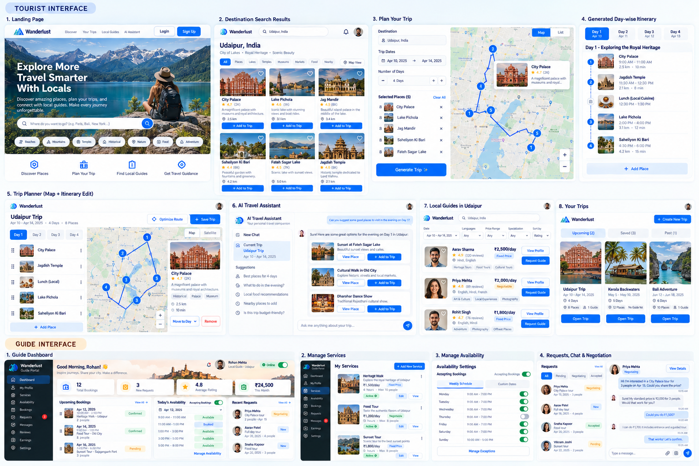

# Wanderlust

Wanderlust is a travel-planning and local-guide marketplace for building geographically sensible itineraries, finding guides who genuinely cover the destination, and moving a guide request through chat, negotiation, booking and review.



## What works

- Responsive Tourist experience: discovery, attraction cards, selected-place trip builder, route workspace, saved trips and local-guide marketplace.
- Deterministic itinerary generation based on coordinates, geographic grouping and nearest-neighbour ordering. It does not use an LLM and does not claim a mathematically optimal route.
- A trip-aware Travel Assistant boundary that never mutates a trip and degrades safely when no provider key is configured.
- One token-auth architecture with Tourist and Guide roles.
- Normalized guide coverage at city, region, area or attraction level; multiple services with fixed or negotiable pricing.
- Weekly availability and date-time exceptions, plus a master `accepting_bookings` control.
- Transactional guide locking and overlap revalidation at confirmation time. Only the confirmed interval is blocked; cancellation exposes the underlying schedule again.
- Private, participant-authorized WebSocket conversations and append-only negotiation offers.
- Review eligibility tied to the Tourist on a completed booking.

## Architecture

```text
React + Redux Toolkit + Vite
        │ REST / WebSocket
Django REST Framework + Channels
        │
PostgreSQL + Redis
        │
Replaceable service adapters
(location, places, routing, imagery, AI)
```

The frontend and backend are independently deployable. Development uses SQLite and the in-memory Channels layer if PostgreSQL/Redis variables are absent; production should use PostgreSQL, Redis and a real ASGI server.

## Project structure

```text
Wanderlust/
├── frontend/                 React application and responsive design system
├── backend/
│   ├── wanderlust/           Django configuration, HTTP and ASGI entrypoints
│   └── core/                 Domain models, APIs, services, chat and tests
├── docs/                     Product reference material
├── docker-compose.yml
├── .env.example
└── README.md
```

## Local setup

### Frontend

```bash
cd frontend
npm install
npm run dev
```

Open `http://localhost:5173`. The UI has realistic demo content so product flows remain inspectable without third-party credentials.

### Backend

```bash
cd backend
python -m venv .venv
# activate the virtual environment
pip install -r requirements.txt
python manage.py makemigrations core
python manage.py migrate
python manage.py createsuperuser
python manage.py runserver
```

The API starts at `http://localhost:8000/api/`; JWT endpoints are `/api/auth/token/` and `/api/auth/refresh/`. WebSocket chat uses `/ws/conversations/<id>/`.

### Docker

```bash
docker compose up --build
```

Copy `.env.example` to `.env`, replace the development values, and never commit it.

## Environment variables

Core variables are documented in `.env.example`. Provider keys are optional during development. The app should use server-side keys only; no provider or LLM secret belongs in the Vite bundle.

Suggested providers:

- Geocoding: OpenStreetMap Nominatim (development-friendly usage policy; cache and respect limits).
- Places: OpenTripMap, Foursquare or Google Places through `PlacesService`.
- Routing: OSRM, Mapbox or Google Routes through `RoutingService`.
- Images: Unsplash or another licensed image provider through an image service.
- AI: a server-side model provider through `AIService`.

## Core logic

### Itinerary generation

`ItineraryService` sorts coordinates deterministically, distributes them across the available days by geographic band, and applies nearest-neighbour ordering within each day. Provider-backed travel times can replace the haversine fallback without changing the trip API. Manual edits carry a `manually_edited` flag; regeneration is an explicit endpoint action.

### Availability and conflict prevention

Availability combines recurring weekday intervals with explicit available/unavailable exceptions. A confirmed booking is itself the booked interval; the rest of the recurring window is untouched. `Booking.confirm()` locks the guide row in a database transaction, queries for interval overlap (`existing.start < requested.end` and `existing.end > requested.start`), and persists the agreed price separately from the current service price. PostgreSQL is required for meaningful concurrent production protection.

### AI assistant

The assistant receives destination, dates, days and stops as context. It returns guidance only. Any provider-suggested place must be resolved through the place service before the UI exposes “Add to trip,” and every mutation requires explicit confirmation.

### Chat and negotiation

Channels authorizes membership before accepting a socket. Messages are append-only with timestamps/read state. Negotiation offers are also append-only so counteroffers never erase history; the booking snapshots both original and final agreed price.

## Testing

```bash
cd backend
python manage.py test

cd ../frontend
npm run build
```

The included backend suite covers deterministic itinerary output, legal request transitions, overlapping booking rejection and adjacent-time acceptance. Extend it with API permission matrices, exception merging, chat authorization, cancellation and review eligibility before production launch.

## Deployment

- Build the frontend with `npm run build` and deploy `frontend/dist` to a static host or CDN.
- Deploy the backend with Daphne/Uvicorn behind TLS, PostgreSQL and Redis. Run migrations as a release step.
- Configure strict hosts/CORS, secure cookies where applicable, provider rate limits, logging, backups and monitoring.
- Keep external APIs behind the service boundaries in `backend/core/services.py`.

## Screenshots

The polished frontend includes desktop and mobile layouts for Discover, the itinerary planner, Your Trips, Local Guides and the Travel Assistant. Add release screenshots here after deploying to the target environment.

